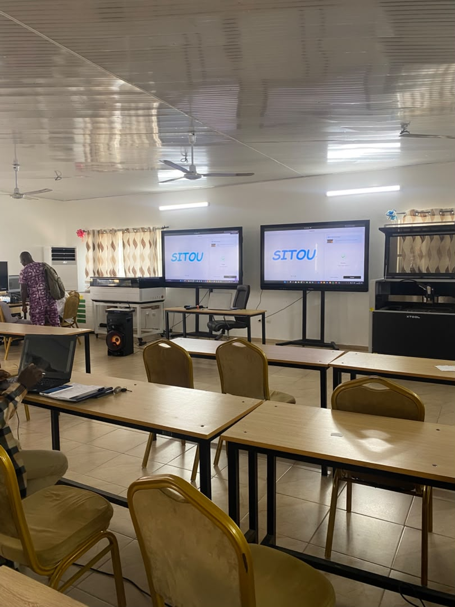
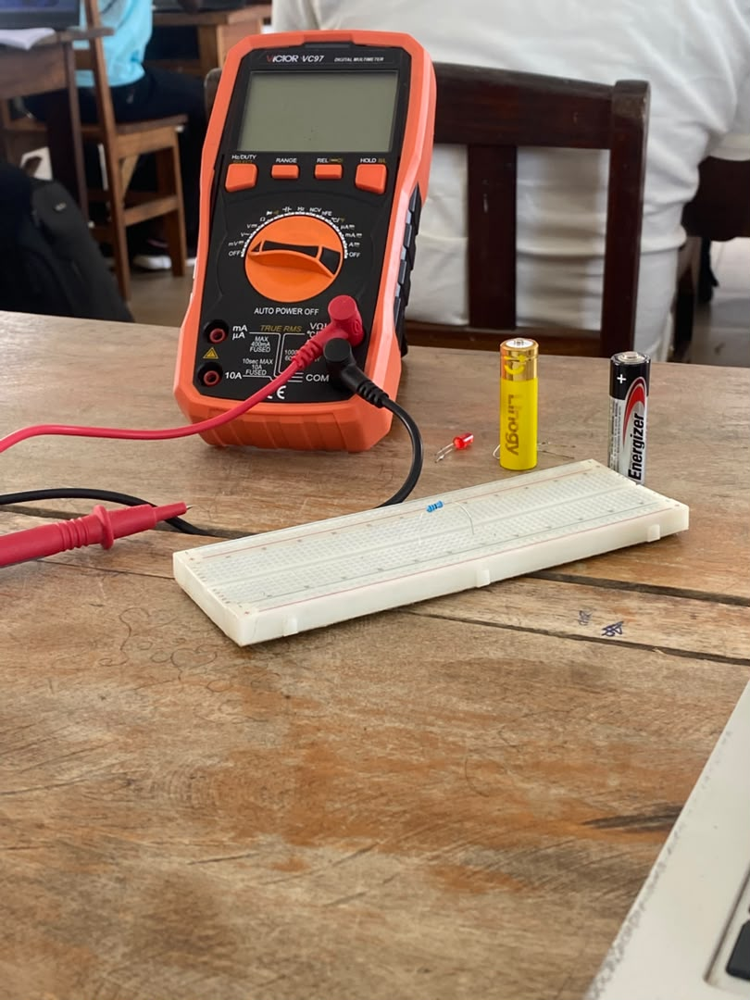

# Journal — mercredi 26 août 2026 (Rédigé par FOLLI Yao Justin)

## Fait aujourd'hui

### Atelier 1 — Découpe laser
- Répartition de l'équipe en **4 groupes** ; le **groupe 2** affecté à la salle de découpe laser (*Metal Fab, xTool P3, xTool F2 Ultra, xTool M1 Ultra*).
- Installation des machines xTool et premier projet : saisie de nos noms dans le logiciel de découpe. Par **contrainte de temps**, seul le formateur a pu réaliser la découpe.  
  

### Atelier 2 — Électronique
- Rappel sur les bases de l'electronique
- Prise en main du **multimètre** (mesure de `tension`, `intensité`, `résistance`) et lecture du **code couleur** des résistances. 
 
  
- Manipulation des **breadboards** (plaquettes d'essais) : principe de continuité et câblage de base.

### Atelier 3 — Impression 3D (fabrication additive)
- Présentation des familles `FDM/FFF`, `SLA`, `DLP`, `MSLA/LCD`, `SLS`, `SLM/DMLS`.
- Découverte des logiciels **Fusion 360** et **Bambu Studio**.

### Atelier 4 — Brainstorming projets incubateurs
- Proposition et discussion collective de plusieurs projets réalisables dans le temps imparti, à vocation éducative et adaptés aux fablabs.

---

## Appris

### Atelier 1 — Découpe laser
- **Anatomie d'une découpeuse laser** : source laser → miroir/fibre optique → tête de focalisation → table CNC → gaz d'assistance → extraction des fumées.
- Les **4 grandes familles de lasers industriels** :

  | Type | Usage |
  |---|---|
  | CO2 | Non métaux |
  | Fibre | Métaux |
  | Diode | Entrée de gamme |
  | UV | Détail fin / verre |

- Correspondance machines ↔ technologies : `xTool P3` = CO2 (Classe 1) · `xTool M1 Ultra` = diode · `xTool F2 Ultra` · `MetalFab` = fibre.
- Notion de **paramètres de découpe** (puissance, vitesse) qui varient selon le matériau et l'épaisseur.
- Importance de l'**extraction des fumées** et des règles de sécurité liées à la classe du laser.

### Atelier 2 — Électronique
- Les **3 grandeurs électriques de base** : tension (V), intensité (A), résistance (Ω), reliées par la **loi d'Ohm**.
- Utilisation pratique du **multimètre** : choix du mode (V, A, Ω), branchement en série/parallèle selon la mesure.
- Lecture d'une **résistance via le code couleur**.
- Rôle du **breadboard** : réaliser un circuit sans soudure, comprendre les lignes de continuité (rails d'alimentation vs pistes de test).

### Atelier 3 — Impression 3D
- Chaîne complète **fichier numérique → objet physique** : modélisation, export, tranchage (slicing), impression.
- Différence entre les grandes familles de procédés : dépôt de matière fondue (`FDM/FFF`), photopolymérisation (`SLA`, `DLP`, `MSLA/LCD`), frittage/fusion de poudre (`SLS`, `SLM/DMLS`).
- Le logiciel de CAO que nous aurons à utiliser (**Fusion 360**) et un logiciel de tranchage (**Bambu Studio**).

### Atelier 4 — Brainstorming
- Méthode de génération collective d'idées de projets, filtrées selon leur **faisabilité dans le temps imparti** et leur **valeur pédagogique**.
- Importance d'adapter un projet incubateur aux ressources réelles d'un fablab.

## Raté, puis corrigé
- Néant

## Décidé
- **Brainstorming** sur les projets incubateurs : Nous avons décidé de reflechir la nuit et de revenir demain avec ces idées de projets pour le groupe N°10
## À faire demain
- [ ] Finaliser le projet de découpe xTool que j'ai initié — **Justin**
- [ ] Poursuivre les reflexions pour trouvé notre projet incubateur — **Groupe 10**