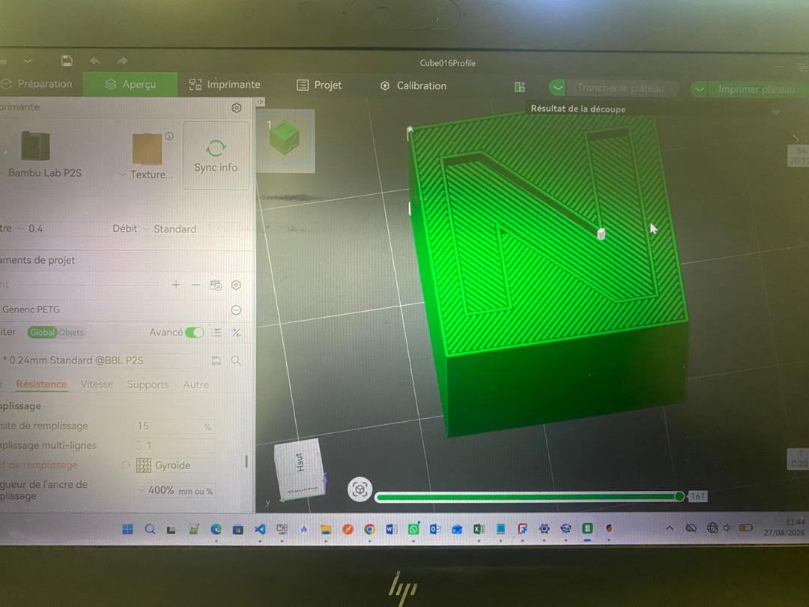
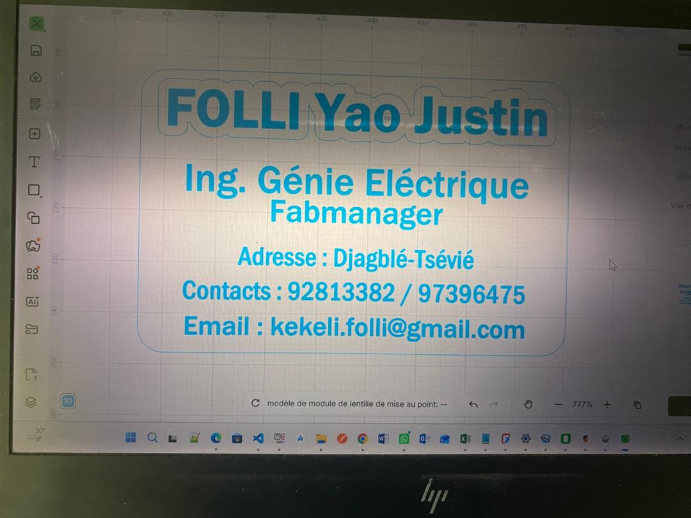

# Journal — Jeudi 27 août 2026 (Rédigé par FOLLI Yao Justin)

## Fait aujourd'hui

### Atelier 1 — Électronique (CyberPi & mBuild)
- Présentation du microcontrôleur **CyberPi** et de ses principales parties.
- Distinction **capteur / actionneur** : capteur de distance et de présence, capteur de suivi de ligne, actionneur de mouvement, module d'alimentation et de liaison.
- Installation de **mBlock** et initiation à l'interface.
- Premier code testé : affichage de LEDs.

### Atelier 2 — Impression 3D
- Installation des logiciels **PrusaSlicer** et **Bambu Studio**.
- Rappel des différentes étapes avant impression et des technologies existantes.
- Impression d'un cube pré-modélisé en **PETG** via Bambu Studio, avec configuration des paramètres d'impression.  
    
  *Cube PETG et paramètres configurés avant impression*

### Atelier 3 — Brainstorming projets
- Atelier non réalisé ; le temps a été utilisé pour installer **Fusion 360**.

### Atelier 4 — Découpe laser
- Découverte des **3 paramètres clés** de la découpe : puissance, vitesse du laser, nombre de passes.
- Exercice pratique : réalisation d'une **carte de visite** (80 mm × 55 mm) découpée sur **xTool P3**.  
    
  *Carte de visite réalisée avec xTool P3*

---

## Appris

### Atelier 1 — Électronique
- Architecture générale d'un microcontrôleur type CyberPi (entrées, sorties, alimentation).
- Un **capteur** mesure une grandeur physique (distance, présence, ligne) ; un **actionneur** produit un mouvement ou une action.
- Prise en main de **mBlock** pour programmer en blocs et premier test simple (LEDs).

### Atelier 2 — Impression 3D
- Utilisation concrète de **Bambu Studio** : réglage des paramètres d'impression pour le **PETG** (matériau différent du PLA classique).
- Confirmation du flux **modélisation → tranchage → impression** vu en théorie la veille, appliqué ici en pratique.

### Atelier 4 — Découpe laser
- Réglage des paramètres selon l'objectif :
  | Objectif | Vitesse | Puissance |
  |---|---|---|
  | Découper | Lente | Élevée |
  | Graver | Élevée | Faible |
- Prise en main de l'**interface xTool** : configuration des paramètres et lancement de la découpe.

---

## Raté, puis corrigé
- Après installation de Vision 360, le logiciel s'ouvrait pas du coup j'ai du desinstaller et réinstaller carrement.

## Décidé
- Les cartes de visites non decoupés avant la fin de l'heure seront imprimées et mise à notre disposition demain

## À faire demain

- [ ] Poursuivre l'exploration de mBlock et des capteurs CyberPi — **Justin**
- [ ] Prendre en main Fusion 360 (modélisation) — **Justin**