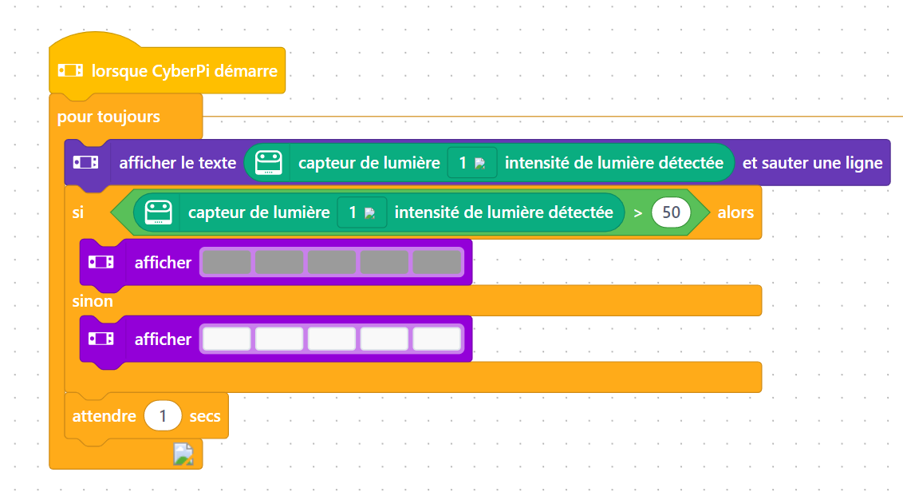
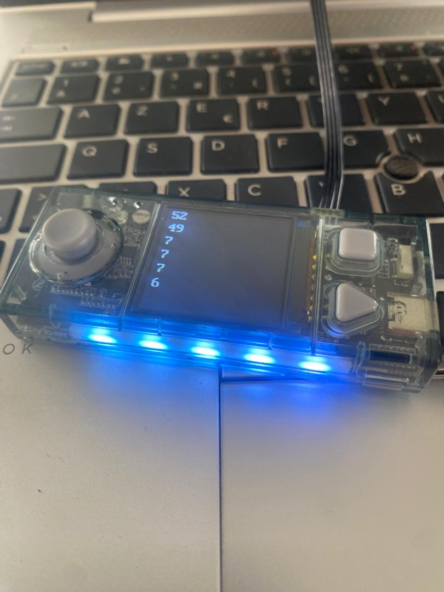

# Journal — Jeudi 27 août 2026 (Rédigé par FOLLI Yao Justin)

## Fait aujourd'hui

### Atelier 1 — Électronique (matin)
- Correction de l'exercice de **jeu de lumière** avec mBlock et CyberPi.
- Nouvel exercice utilisant le **capteur de luminosité**.  
  
      
  *Exercice de jeu de lumière avec le capteur de luminosité*

### Atelier 2 — Découpe laser (matin)
- Finalisation de la découpe de la **carte de visite** commencée la veille sur xTool P3.  
    
  *Carte de visite après découpe*

### Atelier 3 — Impression 3D (matin)
- Slicing d'un **support de téléphone** puis lancement de l'impression.
- Objectif : mise en pratique autonome de la chaîne modélisation → tranchage → impression.

### Après-midi — Design Thinking & méthodologies de projet
- Introduction au **Design Thinking** : origine et finalité (méthode orientée utilisateur).
- Présentation de la **méthode en cascade** ou **méthode en spirale**.

---

## Appris

### Atelier 1 — Électronique
- Utilisation du **capteur de luminosité** pour déclencher une réaction lumineuse conditionnelle (logique capteur → actionneur).
- Consolidation de la prise en main de mBlock via la correction d'exercices.

### Atelier 2 — Découpe laser
- Passage du réglage des paramètres à la **finalisation concrète** d'une pièce découpée.

### Atelier 3 — Impression 3D
- Application pratique du slicing sur un objet utile (support de téléphone), et non plus un objet pré-modélisé fourni.

### Design Thinking
- Le Design Thinking est une **méthode centrée utilisateur**, née pour résoudre des problèmes complexes de façon créative.
- **5 étapes**, non linéaires et **itératives** :
  1. **Empathie** — comprendre l'utilisateur
  2. **Définir** — formuler le problème
  3. **Idée** — générer des solutions
  4. **Prototyper** — construire une version testable
  5. **Tester** — recueillir un retour et itérer
- Différence avec les méthodes classiques de gestion de projet :
  | Méthode | Principe |
  |---|---|
  | Cascade | Étapes séquentielles, linéaires, validées une à une |
  | Spirale | Cycles répétés intégrant risques et retours réguliers |
  | Design Thinking | Itératif, centré utilisateur, non linéaire |

---

## Raté, puis corrigé
- Exercice de jeu de lumière initial comportant une erreur → repris et corrigé collectivement avec mBlock/CyberPi → exercice complété avec succès via le capteur de luminosité.

## Décidé
- Desinstaller et réinstaller fusion qui n'est pas encore fonctionnel

## À faire demain
- [ ] Approfondir les étapes du Design Thinking sur un cas concret pour definir notre projet — **GROUPE 10**