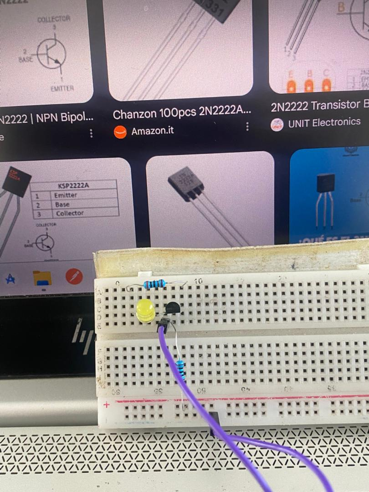
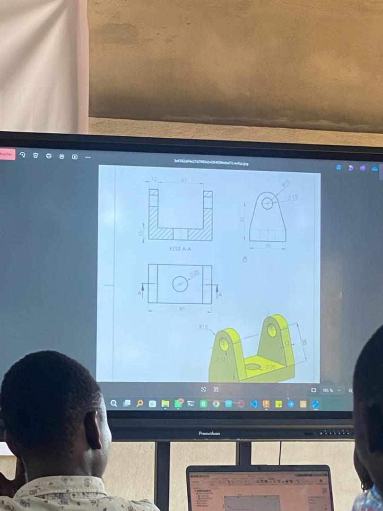
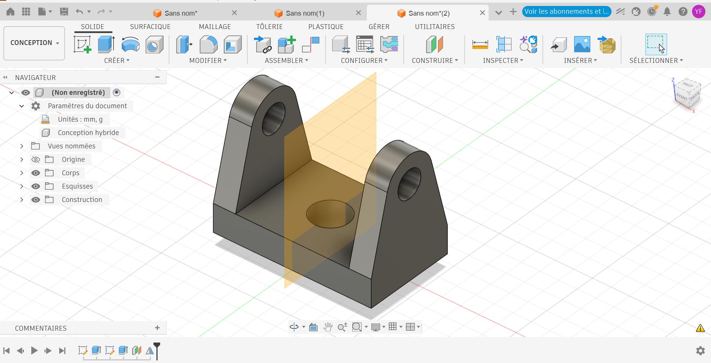

# Journal - Mardi 01 Septembre 2026 (Rédigé par FOLLI Yao Justin)

## Fait aujourd'hui

### Atelier 1 — Maîtriser la breadboard
- Réalisation de **plusieurs circuits** sur breadboard.  
    
  *Exercices de circuits sur breadboard*

### Atelier 2 — Impression DTF avec xTool (Direct To Film)
- Présentation du **matériel nécessaire**, des **étapes** et des **avantages** du DTF.
- Réalisation d'une conception, impression, puis utilisation de la **presse** pour transférer la conception sur un support.

### Atelier 3 — Fusion 360 (approfondissement)
- Découverte de nouveaux **raccourcis** dans Fusion 360.
- Modélisation d'une **pièce mécanique**, avec dimensionnement d'un cylindre de **10 mm**.  
  
     
  *Exercice et résultat de la modélisation*

## Appris

### Atelier 1 — Breadboard
- Consolidation pratique du câblage de circuits simples sans soudure.

### Atelier 2 — DTF
- Les **5 étapes clés** du DTF à retenir : **Concevoir → Imprimer → Poudrer → Cuire → Presser → Retirer**.
- Le DTF permet de transférer une conception imprimée sur un large éventail de supports grâce au pressage à chaud.

### Atelier 3 — Fusion 360
- Gain de rapidité grâce aux **raccourcis clavier/interface**.
- Passage d'une modélisation simple à une **pièce mécanique dimensionnée avec précision** (ex. cylindre de 10 mm), première approche de la rigueur métrique en CAO.

## Raté, puis corrigé
- *Néant*

## Décidé
- *Néant*

## À faire demain

- Faire une séance de travail le matin avec les membres du groupes 2 pour definir des orientations sur nos projets