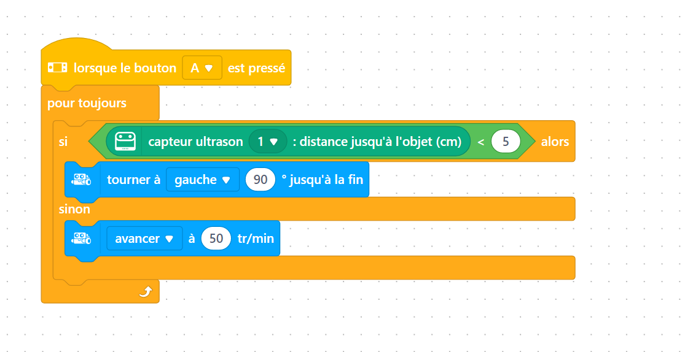
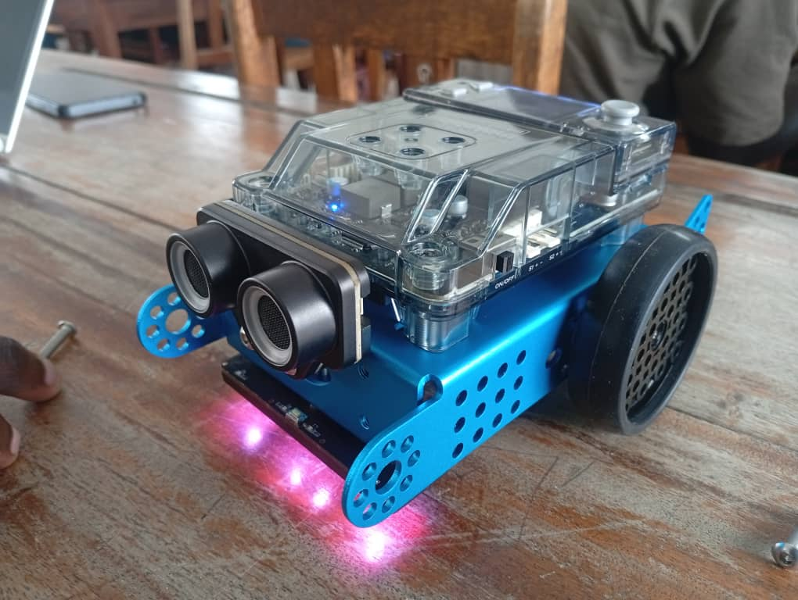

# Journal - Mercredi 02 Septembre 2026 (Rédigé par FOLLI Yao Justin)

## Fait aujourd'hui

### Atelier 1 — Électronique
- Assemblage du **mBot2** et mise en mouvement du robot.
- Utilisation du **capteur ultrason** pour contrôler et éviter les obstacles.  
  
     
  *Code mBlock et robot mBot2 en action*
- Recherche complémentaire sur la **portée des ultrasons**.

### Atelier 2 — Algorithmique
- Étude des **3 critères** qui définissent un algorithme.

### Atelier 3 — Projet
- Travail de groupe l'après-midi sur le projet du groupe 2.
- Définition claire de l'apparence/du fonctionnement du projet.
- Définition du **jalon 2** : simuler le fonctionnement complet du système via un simulateur.

## Appris

### Atelier 1 — Électronique
- Étapes d'assemblage mécanique et électronique d'un robot (mBot2).
- Fonctionnement du **capteur ultrason** : émission/réception d'une onde pour mesurer une distance et détecter un obstacle.
- La **portée d'un capteur ultrason** dépend de facteurs comme la puissance d'émission, l'angle de détection et la nature de l'obstacle (surface, matériau).

### Atelier 2 — Algorithmique
- Un algorithme se définit par **3 critères** :
  1. **Suite ordonnée d'instructions**
  2. **Nombre fini d'étapes**
  3. **Instructions précises** qui résolvent un problème donné

### Atelier 3 — Projet
- Un jalon de projet doit être **concret et vérifiable** : le jalon 2 fixe un objectif clair (simulation complète) plutôt qu'une notion vague de "progrès".

---

## Raté, puis corrigé
- *Néant*

## Décidé
- Le groupe 2 fixe le **jalon 2** : simuler le fonctionnement complet du système depuis un simulateur.

## À faire demain
- [ ] Choisir le simulateur adapté au projet (empreinte digitale + sonnerie) — **Groupe 2**
- [ ] Approfondir la recherche sur la portée des ultrasons — **Justin**