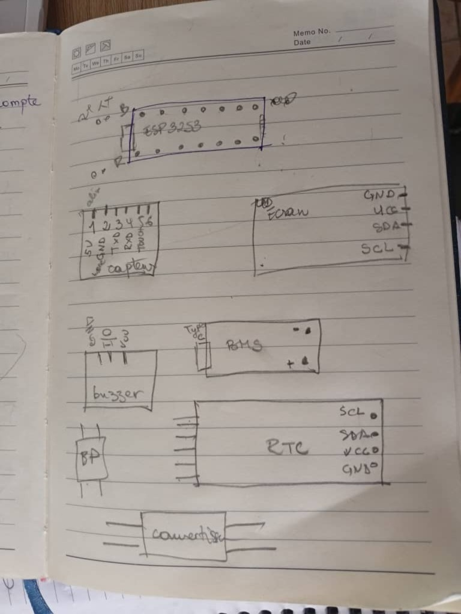

# Journal — jeudi 3 septembre 2026 (Rédigé par FOLLI Yao Justin)

## Fait aujourd'hui

### Atelier 1 — Formation Python
- Introduction aux notions : **langage de programmation**, **syntaxe**, **algorithme**, **pseudo-code**, **compilateur**.
- Présentation des différents niveaux de langage : humain, low-code, haut niveau/orienté objet, intermédiaire, bas niveau, binaire.
- Découverte des **variables** et des **types de données** en Python.

### Atelier 2 — Projet
- Modifications apportées à la **liste des composants** suite à une étude plus approfondie.
- Début de l'étude des **broches des différents composants** pour comprendre leur fonctionnement.  
    
  *Esquisse des composants avec leurs broches*
- Objectif fixé : première simulation finalisée d'ici **samedi 5 septembre**.

---

## Appris

### Atelier 1 — Python
- Un **langage de programmation** est un moyen de transmettre des instructions précises à un ordinateur.
- Hiérarchie des langages, du plus proche de l'humain au plus proche de la machine :
  | Niveau | Exemple |
  |---|---|
  | Langage humain | Français, anglais... |
  | Low-code | Peu de code, interfaces visuelles |
  | Haut niveau / orienté objet | Python |
  | Intermédiaire | C |
  | Bas niveau | Assembleur |
  | Binaire | 0 / 1 |
- Un **compilateur** (ou interpréteur) traduit le code écrit en instructions exécutables par la machine.
- Les **variables** stockent des données typées (nombre, texte, booléen...) manipulables dans un programme.

### Atelier 2 — Projet
- Étudier les **broches** d'un composant est indispensable avant de le simuler : chaque broche a un rôle précis (alimentation, signal, masse...).
- Une simulation fiable repose sur une **liste de composants validée et à jour**.

---

## Raté, puis corrigé
- Liste des composants initiale incomplète → étude plus approfondie menée → liste corrigée et améliorée.

## Décidé
- La première simulation complète du système sera finalisée d'ici **samedi 5 septembre**, conformément au jalon 2 fixé la veille.

## À faire demain
- [ ] Terminer l'étude des broches de tous les composants — **Groupe 10**
- [ ] Choisir et paramétrer le simulateur pour la simulation du 5 septembre — **GROUPE 10**
- [ ] Pratiquer les bases de Python (variables, types) — **Justin**