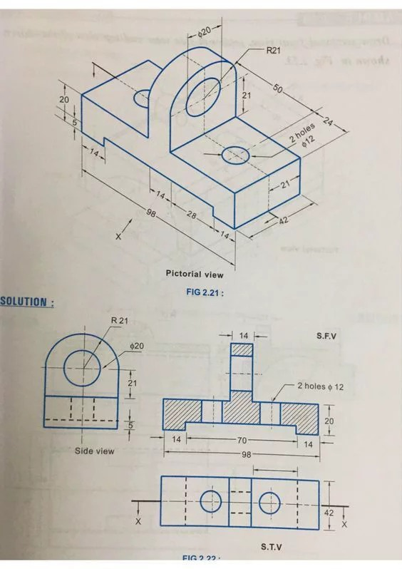
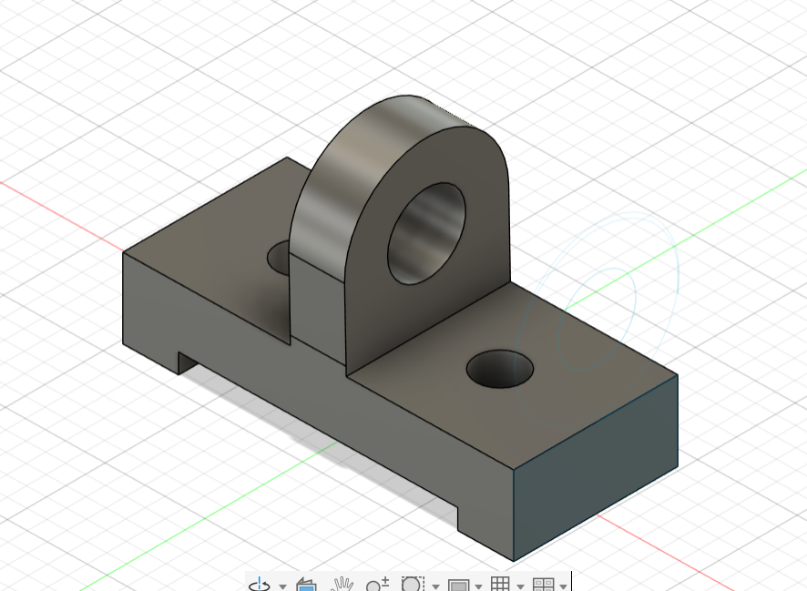

# Journal — vendredi 4 septembre 2026 (Rédigé par FOLLI Yao Justin)

## Fait aujourd'hui

### Atelier 1 — Python : opérateurs et boucles
- Étude des opérateurs indispensables : **arithmétiques**, **logiques**, **comparaison**, **affectation**.
- Découverte de la **boucle for** et de la **boucle while**.
- Autre écriture possible pour le **tuple**.

### Atelier 2 — Fabrication de PCB
- Réflexion sur **pourquoi utiliser un PCB**.
- Présentation des principales **méthodes de fabrication** de PCB.
- Utilisation de l'**xTool F2** pour la fabrication de PCB, avec les paramètres suivants :
  | Paramètre | Valeur |
  |---|---|
  | Puissance (P) | 100 |
  | Vitesse (V) | 800 |
  | Nombre de passes | 15 |
  | Dimensions | 200 x 200 mm |
  | Fréquence | 30 |

### Atelier 3 — Modélisation 3D
- Exercice de modélisation d'une pièce.
- Phase de conception suivie d'une **correction collective**.  
  

    
  *Énoncé de l'exercice et pièce modélisée*

## Appris

### Atelier 1 — Python
- Les **4 familles d'opérateurs** en Python : arithmétiques (`+ - * /`), logiques (`and`, `or`, `not`), de comparaison (`== != < >`), d'affectation (`= += -=`).
- La **boucle for** répète un nombre défini/itérable d'exécutions ; la **boucle while** répète tant qu'une condition reste vraie.
- Un **tuple** peut s'écrire de plusieurs façons en Python (avec ou sans parenthèses).

### Atelier 2 — PCB
- Le **PCB** (Printed Circuit Board) permet de fixer et relier durablement des composants électroniques sans câblage volant.
- La découpe/gravure laser d'un PCB dépend de paramètres précis (puissance, vitesse, nombre de passes, fréquence) qui doivent être ajustés selon le matériau et l'épaisseur du cuivre.

### Atelier 3 — Modélisation 3D
- Passer par une **phase de correction** après un premier essai de modélisation permet d'identifier les erreurs de cotation ou de conception.

---

## Raté, puis corrigé
- Première conception de la pièce en modélisation 3D comportant des erreurs → identifiées lors de la phase de correction → conception ajustée.

## Décidé
- *Néant*

## À faire demain
- Néant