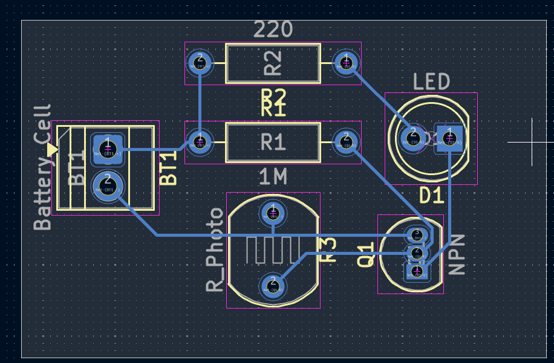
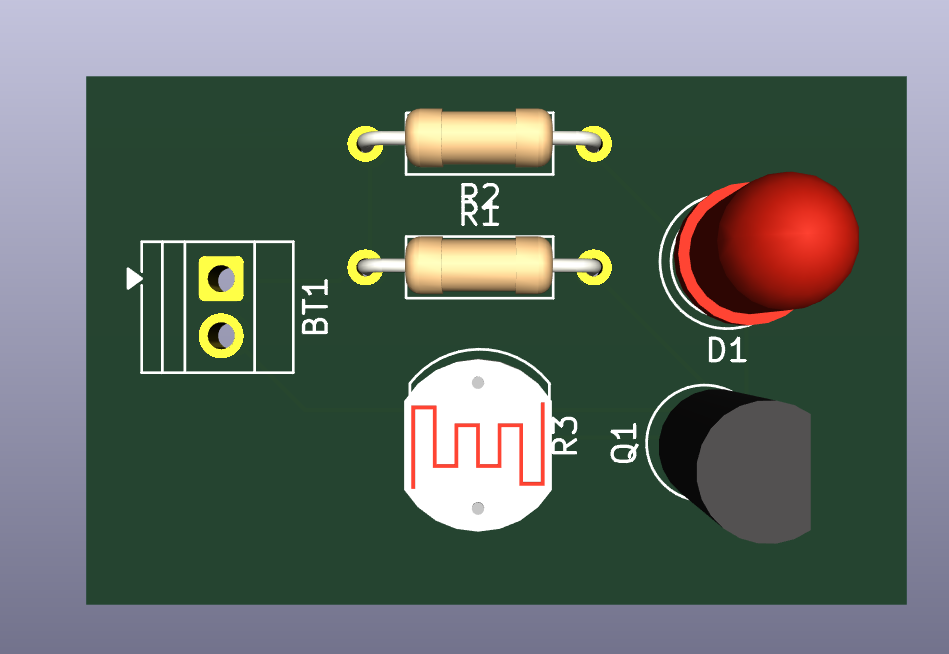

# Journal — lundi 7 septembre 2026 (Rédigé par FOLLI Yao Justin)

## Fait aujourd'hui

Cette journée à été consacré essentiellement à la fabrication de circuit PCB : 

Elle s'est articulé autour de 3 grands axe à savoir :

### Introduction à la fabrication du PCB
- Distinction de rôle : la **breadboard** sert à expérimenter, le **PCB** sert à transformer l'expérience en plaquette réelle et durable.
- Discussion sur **pourquoi passer du prototype au PCB**, avec quelques avantages associés.
- Présentation de l'**anatomie d'un PCB** (éléments essentiels d'une carte).

### De l'idée au schéma
- Étude des composants d'un **interrupteur crépusculaire**.
- Transformation manuelle du montage en **schéma**.

### Initiation à KiCad
- Installation et présentation de l'**interface de KiCad**.
- Reconstruction du circuit de l'interrupteur crépusculaire dans KiCad.
- Transformation du schéma en **circuit PCB**.

---

## Appris

### Introduction — PCB
- Le passage du prototype (breadboard) au PCB apporte fiabilité, compacité et reproductibilité par rapport à un montage temporaire.
- Une carte PCB est composée d'éléments essentiels : pistes conductrices, pastilles de soudure, trous de perçage, substrat isolant, sérigraphie.

### De l'idée au schéma
- Un **interrupteur crépusculaire** utilise une photorésistance pour détecter la luminosité ambiante et commander automatiquement un interrupteur.
- Passer du montage physique au **schéma** oblige à identifier clairement chaque composant et sa fonction dans le circuit.

### Initiation — KiCad
- **KiCad** permet de dessiner un schéma électronique puis de le convertir directement en **circuit imprimé (PCB)** prêt à fabriquer.
- Le flux complet : schéma → attribution des empreintes (footprints) → placement des composants → routage des pistes → export PCB.

---

## Raté, puis corrigé
- *Néant*

## Décidé
- 

## À faire demain
- [ ] S'entrainer avec le le circuit du NE55 envoyé dans le groupe.