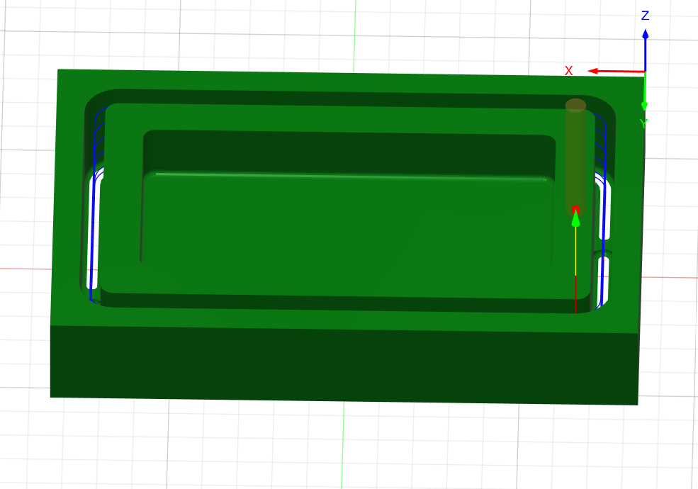

# Journal — mardi 8 septembre 2026 (Rédigé par : Justin FOLLI)

## Fait aujourd'hui

### Atelier 1 — FAO et usinage CNC

La matinée a été consacrée à la fabrication assistée par ordinateur, de la conception à la pièce usinée.

- Retour sur l'**interface de Fusion 360**, déjà vue mais approfondie aujourd'hui.
- Fabrication complète d'une pièce, jusqu'à la génération du **G-code**.  
    
  _Pièce conçue en vue de l'usinage CNC_

### Atelier 2 — Projet

L'après-midi a été consacré à l'avancement du projet du groupe.

- Répartition des différentes tâches entre les membres.
- Accès à quelques composants réels, ce qui a permis de **redéfinir le schéma électronique** et d'ajuster les mesures pour la conception du boîtier.
- Attribution des **broches** aux différents composants pour la suite du projet.

---

## Appris

- La **FAO** (Fabrication Assistée par Ordinateur) prolonge la CAO : une fois la pièce modélisée, il faut encore générer les trajectoires d'usinage et le **G-code** que la machine CNC va exécuter.
- Avoir les **composants réels** en main change souvent les plans sur papier : les dimensions et contraintes physiques obligent à revoir le schéma et le boîtier en conséquence.
- Differences entre l'impression addictive et la soustrative
- Attribuer les **broches** dès cette étape évite des erreurs de câblage plus tard, au moment de l'assemblage final.

---

## Raté, puis corrigé

- Le schéma électronique initial ne correspondait pas totalement aux composants réellement disponibles → constat à la réception des composants → schéma et mesures du boîtier redéfinis en conséquence.

## Décidé

- Répartition officielle des tâches au sein du groupe pour la suite du projet.
- Attribution validée des broches pour chaque composant du système.

## À faire demain

- [ ] Revoir la documentation du groupe et la mettre en ligne — **Groupe 10**
- [ ] Amender la première version du boîtier en conception — **Groupe 10**
- [ ] Présenter les différents diagrammes de la base de données — **Justin**
