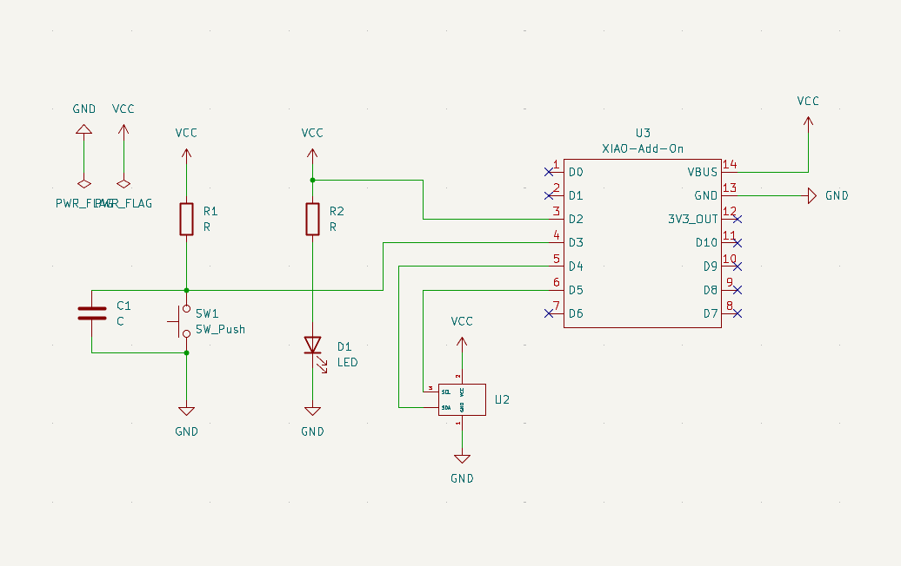
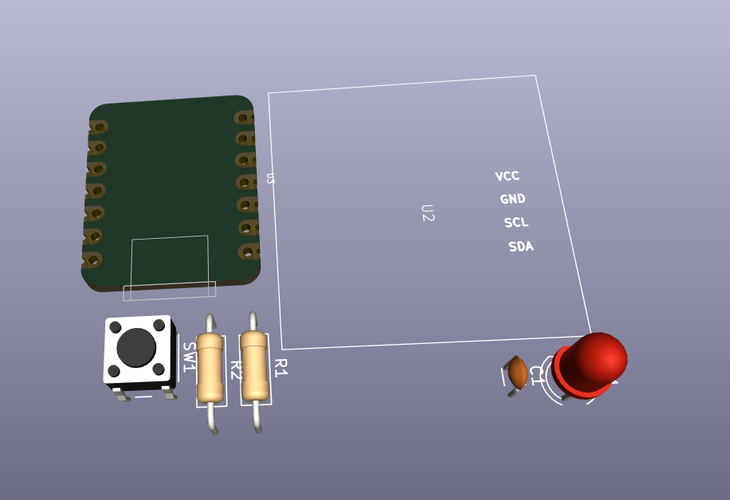

# Journal — mercredi 9 septembre 2026 (Rédigé par : Justin FOLLI)

## Fait aujourd'hui

Aujourd'hui, l'objectif était clair et ambitieux : partir de zéro et aller jusqu'au produit final.

### Matinée — Du schéma électronique au PCB

- Réalisation du **schéma électronique** du projet.  
    
  _Schéma électronique_
- Réalisation de la **vue 3D** correspondante.  
    
  _Vue 3D du projet_
- Constat : tous les composants ne sont pas disponibles nativement dans KiCad, et même les librairies existantes ne couvrent pas tout.
- Ajout d'une **librairie pour le Xiao ESP32-S3**, et création d'une **librairie personnalisée pour l'écran Oled**.
- Découverte qu'une librairie peut être ajoutée soit pour un seul projet, soit **globalement** — nous avons choisi l'option globale.
- Poursuite avec les **assignations** des composants, puis passage au **circuit PCB**.

### Après-midi — Rappels théoriques et code

- Petit retour aux fondamentaux : qu'est-ce que l'**informatique**, un **PC**, la différence **hardware / software**, et les **périphériques d'entrée et de sortie**.
- Écriture du code **MicroPython** pour piloter l'ensemble du système.

---

## Appris

- Dans **KiCad**, une librairie peut être installée **par projet** (locale) ou **globalement** (disponible pour tous les futurs projets) — un choix à faire selon qu'on travaille seul ou en équipe sur plusieurs projets.
- Créer sa **propre librairie** (ex. pour l'écran) est parfois nécessaire quand le composant n'existe dans aucune bibliothèque officielle.
- Rappel structurant : un ordinateur combine toujours du **hardware** (les composants physiques) et du **software** (les programmes), reliés par des **périphériques d'entrée** (clavier, capteurs...) et de **sortie** (écran,...).
- Le passage schéma → assignation → PCB suit une logique précise : chaque étape dépend de la précédente pour ne pas générer d'erreurs de routage.

---

## Raté, puis corrigé

- Composants et librairies manquants dans KiCad au moment du schéma → recherche et ajout de la librairie Xiao ESP32-S3 → création d'une librairie maison pour l'écran, faute d'alternative existante.

## Décidé

- Installation des librairies KiCad en mode **global**, pour pouvoir les réutiliser sur les prochains projets sans tout refaire.

## À faire demain

- [ ] Finaliser le routage du PCB — **Justin**
- [ ] Tester le code MicroPython sur le montage réel — **Justin 2**
- [ ] Modeliser la pièce
- [ ] Documenter la librairie personnalisée de l'écran pour le reste du groupe — **Justin**
