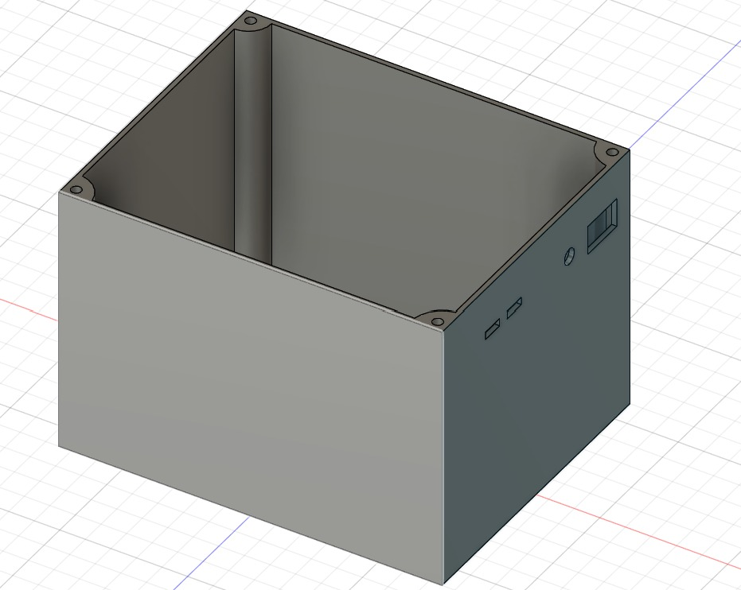
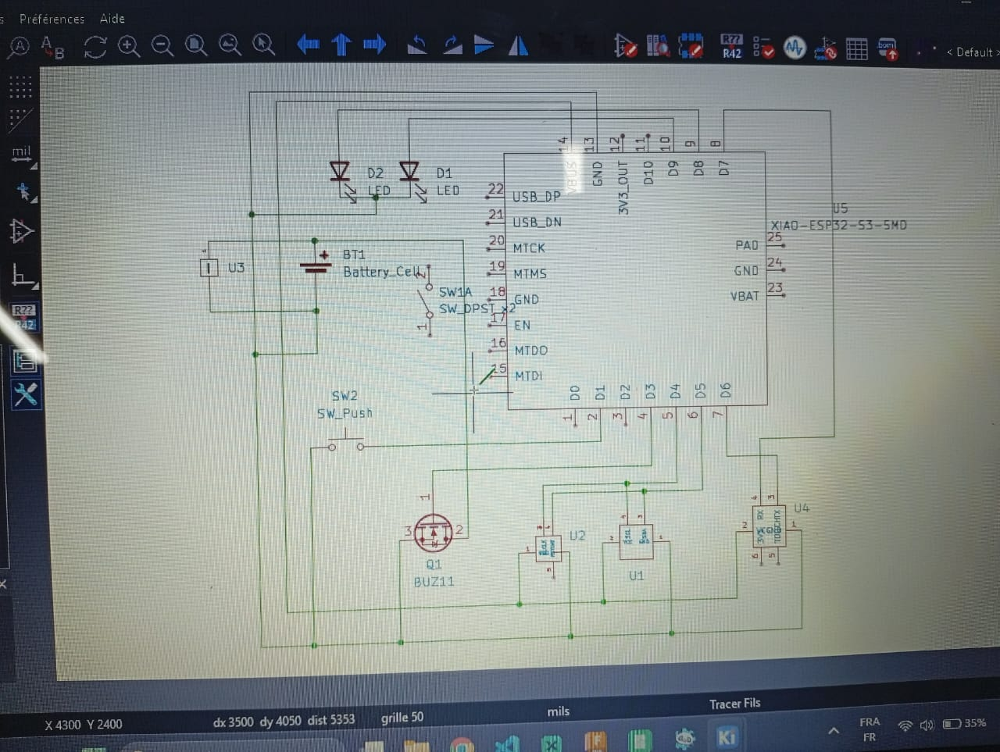
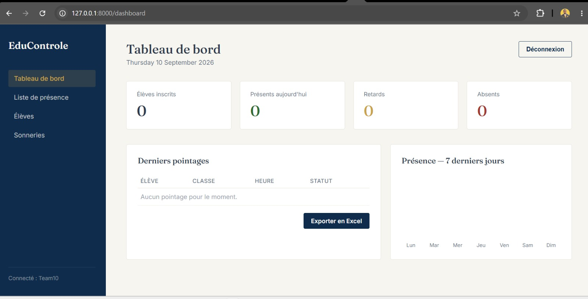
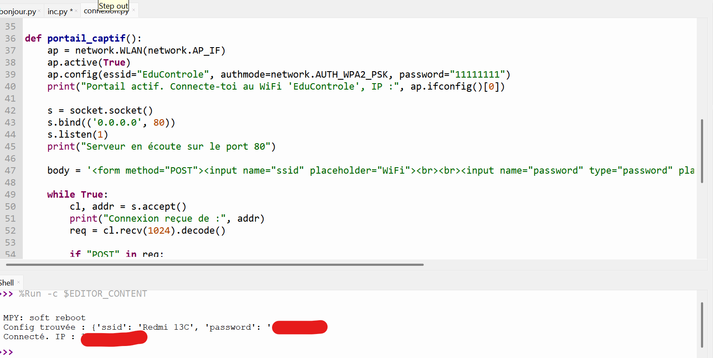

# Journal — jeudi 10 septembre 2026 ( Rédigé par : Justin FOLLI)

## Fait aujourd'hui

La journée a été entièrement consacrée à l'avancement de notre projet.

### Réception des composants et organisation

- Réception d'une partie des **composants** du projet.
- Répartition rapide en **3 sous-groupes** pour avancer en parallèle :
  - 2 personnes sur la **modélisation du boîtier**
  - 1 personne sur le **circuit électronique**
  - 1 personne (moi) sur la **plateforme web**

### Modélisation du boîtier

- Prise de mesures sur les composants reçus pour bien dimensionner le boîtier.  
    
  _Pièce du boîtier en cours de réalisation_

### Circuit électronique

- Comme une première simulation avait déjà été faite sur **CirkitDesign**, le groupe a pu attaquer directement la réalisation du circuit électronique.  
    
  _Circuit électronique en cours de réalisation_

### Plateforme web (ma partie)

- **Dashboard du site web entièrement terminé.**
- Ajout d'une nouvelle **table "classes de l'école"** dans la base de données, destinée à alimenter une liste déroulante lors de l'ajout des élèves.  
    
  Page d'acceuil de notre plateforme web
- Flash du microcontrôleur **Xiao ESP32-S3**, en suivant les étapes habituelles.
- Écriture d'un petit programme **MicroPython** pour connecter la carte à internet.  
    
  _Terminal confirmant la connexion internet réussie_

---

## Appris

- Travailler en **sous-groupes parallèles** (boîtier / électronique / web) permet de faire avancer un projet sur plusieurs fronts en même temps, à condition que chacun sache exactement sur quoi il travaille.
- Concevoir un boîtier ne se fait pas sur des estimations : il faut **mesurer réellement** les composants reçus pour avoir des dimensions justes.
- Avoir déjà validé une **simulation** (ici sur CirkitDesign) donne la confiance nécessaire pour passer directement à la réalisation physique du circuit, sans repartir de zéro.
- Confirmer une **connexion internet** depuis un ESP32-S3 en MicroPython est une première étape indispensable avant d'envisager l'envoi de données vers la plateforme web.

---

## Raté, puis corrigé

- _Néant_

## Décidé

- Répartition définitive des rôles pour cette phase du projet : boîtier, circuit électronique, plateforme web.

## À faire demain

- [ ] Continuer la modélisation et l'ajustement du boîtier avec les vraies mesures — **Marc et Victorienne**
- [ ] Poursuivre l'assemblage du circuit électronique — **Moïse**
- [ ] Faire communiquer le Xiao ESP32-S3 avec la plateforme web (envoi de données) — **Justin**
