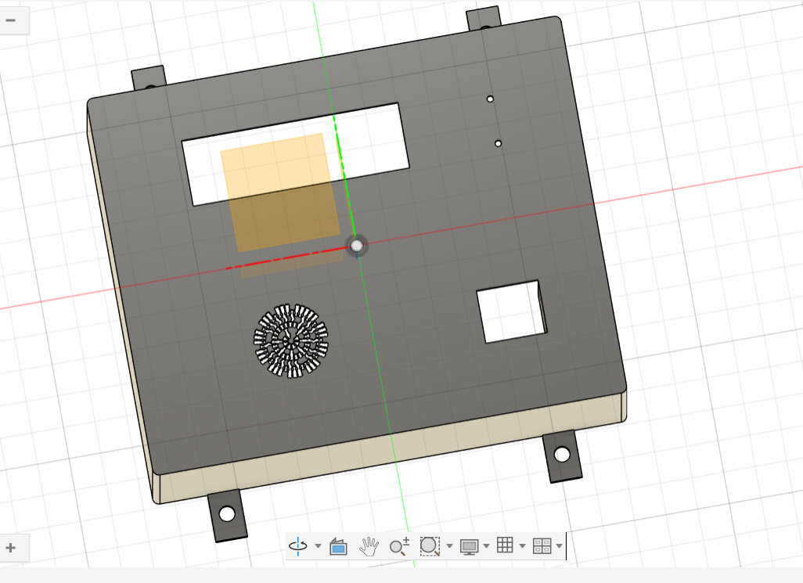
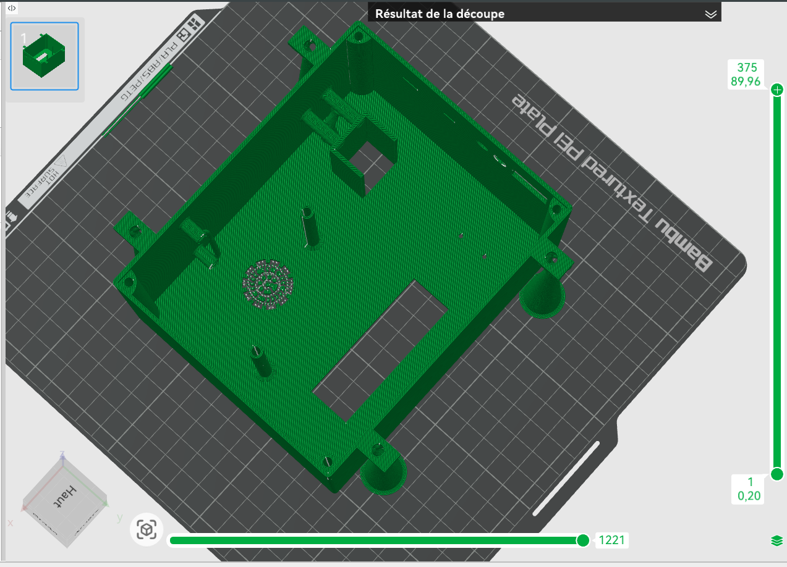

# Journal — vendredi 11 septembre 2026 ( Rédigé par : Justin FOLLI )

## Fait aujourd'hui

Journée entièrement consacrée à l'avancement du projet.

### Boîtier

- Conception terminée pour toutes les **différentes pièces à assembler** du boîtier.  
    
  _Boîtier finalement retenu_
- Préparation de la pièce dans **Bambu Lab**, puis **slicing** en vue de l'impression.  
    
  _Pièce dans Bambu Lab, prête à imprimer_
- Impression non réalisée aujourd'hui, faute d'**imprimante disponible** — reportée à demain.

### Circuit électronique

- Une partie de l'équipe a **finalisé le circuit électronique**.
- Passage aux tests et au **circuit PCB** en attente de la réception du reste des composants.

### Code MicroPython

- L'ensemble du **groupe 10** a démarré ensemble l'écriture du code MicroPython pour piloter les composants actuellement disponibles.

---

## Appris

- Le passage **conception → Bambu Lab → slicing** doit être anticipé, car la disponibilité d'une imprimante n'est pas garantie au moment voulu.
- Un projet peut avancer sur plusieurs fronts même quand une étape est bloquée (ici l'impression) : le circuit électronique et le code ont continué en parallèle.
- Commencer à coder en **MicroPython** avec les composants déjà en main permet de valider une partie du système sans attendre 100% des pièces.

---

## Raté, puis corrigé

- Impression du boîtier prévue aujourd'hui → aucune imprimante disponible → slicing terminé et impression reportée à demain.

## Décidé

- L'impression du boîtier est reportée à demain, dès qu'une imprimante sera libre.
- Le circuit PCB attendra la réception complète des composants avant d'être lancé.

## À faire demain

- [ ] Imprimer les pièces du boîtier
- [ ] Poursuivre le code MicroPython avec les composants disponibles
