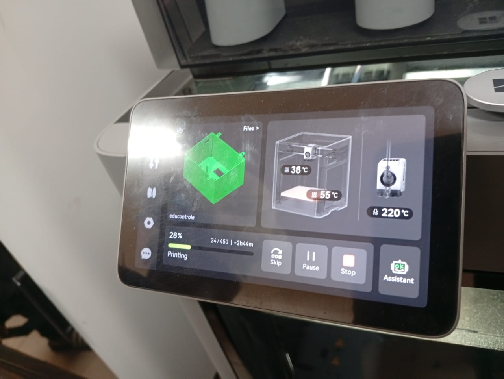
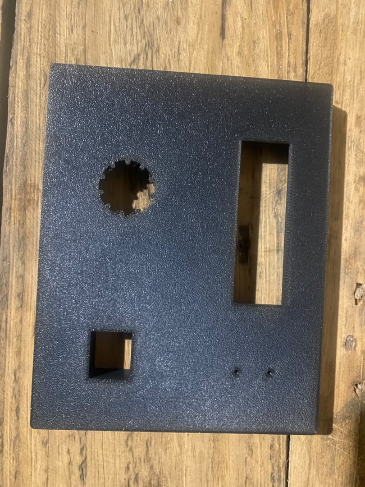
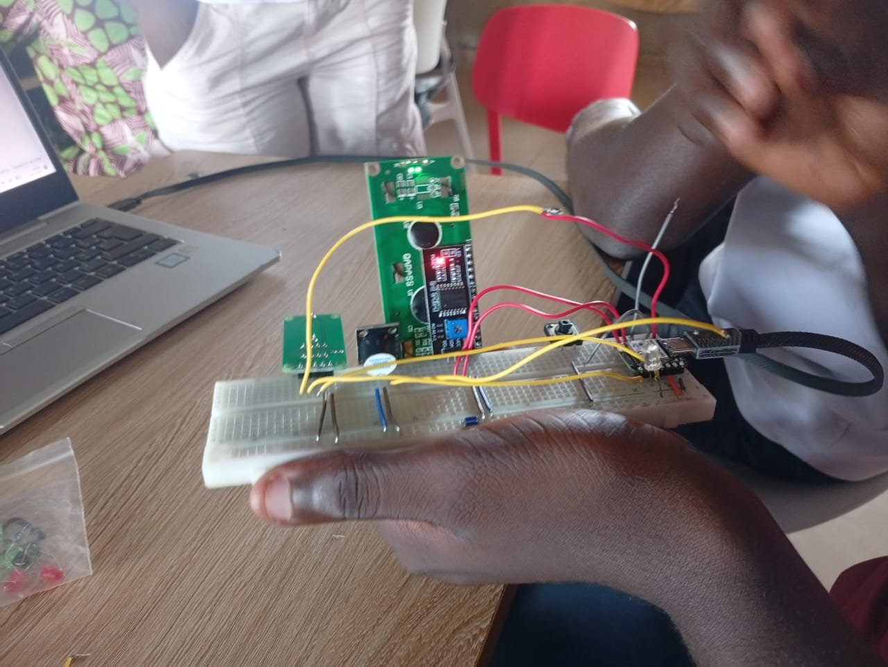

# Journal — samedi 12 septembre 2026 (Rédigé par : Justin FOLLI)

## Fait aujourd'hui

Poursuite du travail sur le projet ce matin.

### Impression du boîtier

- Lancement de l'**impression du boîtier**, puis **annulation** après avoir constaté plusieurs anomalies :
  - Oubli des **supports** lors du slicing.
  - La zone de **sortie du son** ne tenait pas correctement.
  - Le **diamètre des trous** prévus pour la LED n'a pas été bien interprété lors de la conception.
  - Idem pour le trou de l'**écran**, toujours pas correct.  
    

    
    _Partie de la pièce imprimée, avec les défauts constatés_

- Malgré cela, poursuite de l'impression pour le **couvercle** et la pièce de **maintien** à l'intérieur du boîtier.

### Montage et tests électroniques

- Montage du circuit sur une **plaquette SK10** pour effectuer des tests.
- Faute de disponibilité, le **capteur d'empreinte digitale R307** a été remplacé par un **bouton poussoir** pour valider la logique du montage.
- Test **concluant**.  
    
  _Montage de test sur plaquette SK10_

---

## Appris

- L'oubli des **supports au slicing** peut compromettre des zones en surplomb même si le reste de la pièce s'imprime correctement.
- Les **diamètres de petits trous** (LED, écran) doivent souvent être légèrement surdimensionnés dans le modèle, car l'imprimante ne les reproduit pas toujours fidèlement.
- Remplacer temporairement un composant manquant (capteur R307) par un composant équivalent en logique (bouton poussoir) permet de **valider le comportement du circuit** sans attendre la pièce définitive.
- Une plaquette comme la **SK10** est utile pour des tests rapides et fiables avant de passer au PCB définitif.

---

## Raté, puis corrigé

- Impression du boîtier lancée avec des défauts (supports manquants, trous mal dimensionnés) → constat en cours d'impression → impression annulée pour cette pièce, reprise du modèle nécessaire avant un nouvel essai.

## Décidé

- Poursuite de l'impression pour le couvercle et la pièce de maintien, malgré l'échec de la pièce principale.
- Utilisation d'un bouton poussoir en remplacement provisoire du capteur R307 pour ne pas bloquer les tests électroniques.

## À faire demain

- [ ] Corriger le modèle du boîtier (ajouter les supports, ajuster les diamètres LED/écran) — **Justin**
- [ ] Relancer l'impression de la pièce principale corrigée lundi matin — **Marc**
- [ ] Intégrer le capteur R307 dès réception et refaire le test sur SK10 — **Toute l'équipe**
