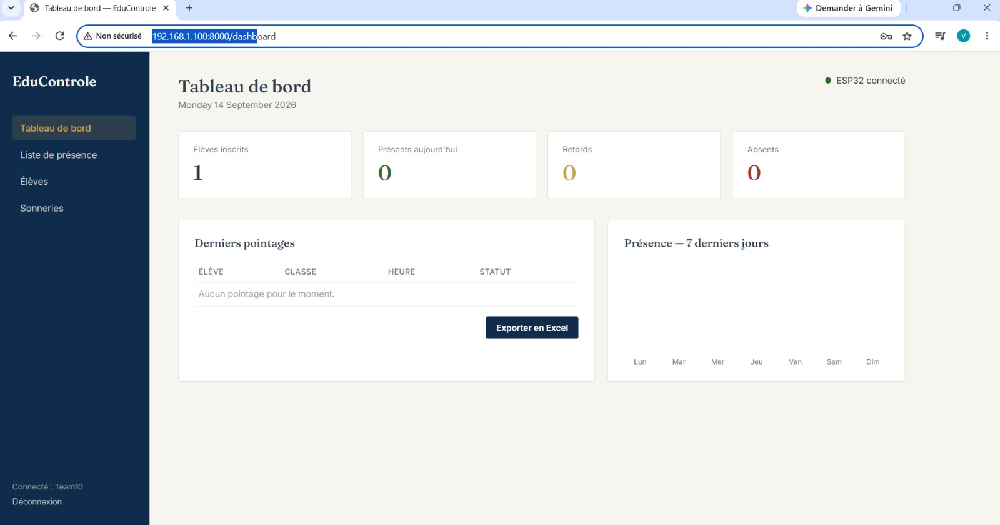
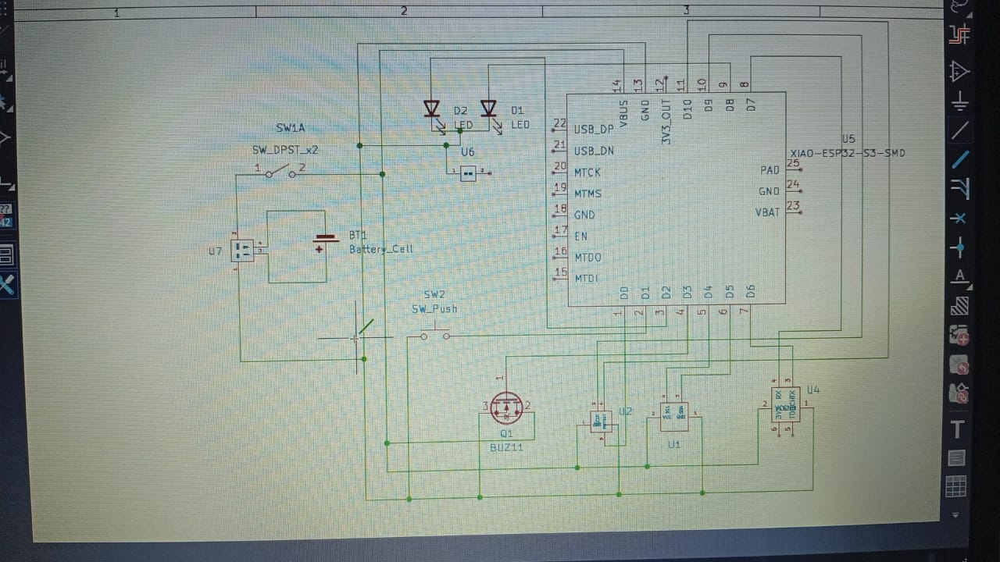

# Journal — lundi 14 septembre 2026 (Rédigé par : Justin FOLLI)

## Fait aujourd'hui

Encore une journée entière consacrée à notre projet, et on avance clairement sur plusieurs fronts.

### Côté plateforme web (ma partie)

J'ai continué la construction de notre application web sous **Laravel 13**. Au programme aujourd'hui : la mise en place de plusieurs pages clés du système.

- Le **dashboard**
- La **page de présence**
- La **page des élèves**
- La **page des sonneries**

_Dashboard de l'application web_

Une fois ces pages en place, je me suis attaqué à un point plus délicat : essayer de **connecter la plateforme web à notre microcontrôleur**, pour permettre l'échange de données entre les deux côtés du projet — le matériel et le logiciel.

### Test collectif

Le moment fort de la journée : ensemble, nous avons testé le **déclenchement des sonneries directement depuis l'application web**. Voir la commande partir d'une page web et se traduire par une action physique, c'est toujours satisfaisant après plusieurs jours de travail séparé sur chaque brique.

### Côté matériel

Nous attendons toujours une partie de nos composants, ce qui freine un peu l'avancée complète du montage physique :

- Capteur d'empreintes digitales **R307**
- Module **RTC DS3231** (ou équivalent I2C)
- Écran **LCD 20x4**
- Deux batteries rechargeables **3,7V**
- Support batterie **2x1**

En attendant, des **modifications ont été apportées au circuit électronique** pour l'adapter aux contraintes rencontrées jusqu'ici.

_Circuit électronique après modifications_

---

## Appris

- Construire une application avec **Laravel 13** page par page (dashboard, présence, élèves, sonneries) aide à garder une vision claire de ce qu'il reste à faire, plutôt que de tout vouloir avancer en même temps.
- Faire communiquer une **plateforme web et un microcontrôleur** n'est jamais juste une formalité : il faut que les deux « parlent le même langage » (protocole, format des données) pour que l'échange fonctionne réellement.
- Réussir à déclencher une action physique (la sonnerie) depuis une interface web est une vraie validation : ça prouve que la chaîne complète — web, réseau, microcontrôleur, actionneur — fonctionne de bout en bout, même si tous les composants ne sont pas encore là.
- Ne pas avoir tous les composants en main n'empêche pas d'avancer : on peut continuer à **adapter le circuit** en anticipant leur arrivée plutôt que d'attendre les bras croisés.

---

## Raté, puis corrigé

- Le module RTC qui travaillais bien la veille ne fonctionne plus. Nous avons fait de notre mieux sans parvenir à le faire.

## Décidé

- Poursuivre la modification du circuit électronique en anticipant l'arrivée des composants manquants (R307, DS3231, LCD 20x4, batteries), plutôt que de mettre le projet en pause.

## À faire demain

- [ ] Continuer la connexion plateforme web ↔ microcontrôleur pour fiabiliser l'échange de données — **Justin**
- [ ] Relancer l'équipe formatrice sur les composants restants — **Groupe 10**
- [ ] Poursuivre l'adaptation du circuit électronique en fonction des contraintes rencontrées — **Groupe 10**
