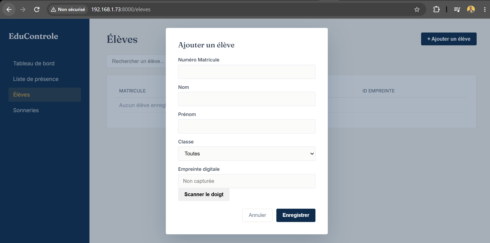
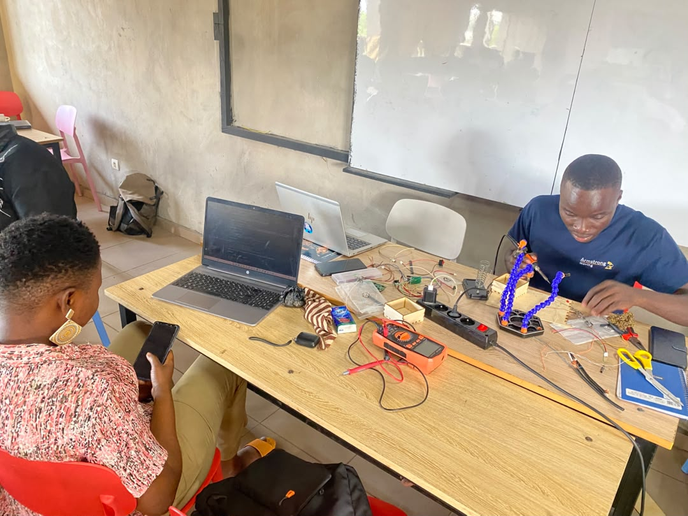

# Journal — mardi 15 septembre 2026 (Rédigé par : Justin FOLLI)

## Fait aujourd'hui

Belle journée pour le projet : plusieurs avancées concrètes, sur presque tous les fronts.

### Réception des composants

Nous avons enfin reçu une bonne partie de nos composants restants. Il ne manque plus, à ce stade, que le **module RTC DS3231** — et bonne nouvelle, sa réception est déjà confirmée pour **demain matin**.

Avec ces nouveaux composants en main, nous avons pu **redéfinir les broches** du montage, en tenant compte de l'arrivée imminente du RTC.

### Côté plateforme web (ma partie)

J'ai continué à faire avancer le site : ajout d'une **page pour enregistrer les élèves** directement dans la base de données. Une brique de plus dans le système, qui commence vraiment à prendre forme.
Ci-dessous une capture d'ecran de la page

_Formulaire d'ajout d'eleves_

### Côté impression 3D

Bonne nouvelle également de ce côté : une partie de l'équipe a **finalisé l'impression du boîtier**, après les ajustements faits ces derniers jours suite aux premiers échecs.

### Côté code MicroPython

J'ai travaillé sur **plusieurs parties du code MicroPython**, dans l'objectif de couvrir progressivement toutes les fonctionnalités prévues dans notre **cahier des charges**.

### Côté circuit PCB

Une autre partie de l'équipe s'est concentrée sur le **circuit PCB** : plusieurs **soudures** ont été réalisées aujourd'hui, un travail minutieux mais qui nous rapproche clairement d'un PCB prêt à l'emploi.

_Formulaire d'ajout d'eleves_

---

## Appris

- Un projet avec plusieurs briques (web, boîtier, code, PCB) avance plus vite quand chaque sous-équipe peut progresser **en parallèle**, sans dépendre systématiquement des autres.
- La **soudure** sur un circuit PCB demande de la précision et du temps, mais c'est une étape qui rapproche concrètement d'un produit final robuste, contrairement à un montage sur plaquette d'essai.
- Développer le code MicroPython **fonctionnalité par fonctionnalité**, en suivant le cahier des charges, permet de ne rien oublier et de vérifier chaque brique indépendamment.

---

## Raté, puis corrigé

- _Néant_

## Décidé

- Les broches du montage sont redéfinies dès aujourd'hui pour intégrer le module RTC DS3231, dont la réception est prévue demain matin.

## À faire demain

- [ ] Réceptionner et intégrer le module RTC DS3231 — **Groupe 10**
- [ ] Poursuivre les soudures et l'assemblage du circuit PCB — **Moïse**
- [ ] Continuer le développement du code MicroPython selon le cahier des charges — **Justin**
