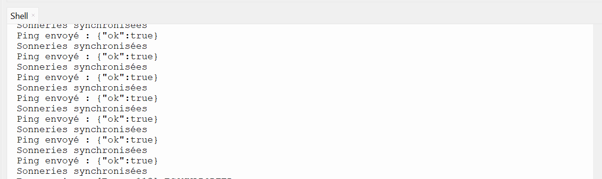
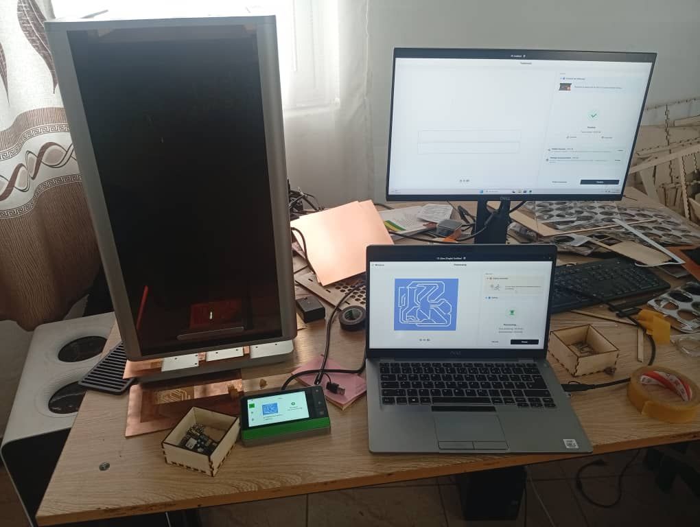
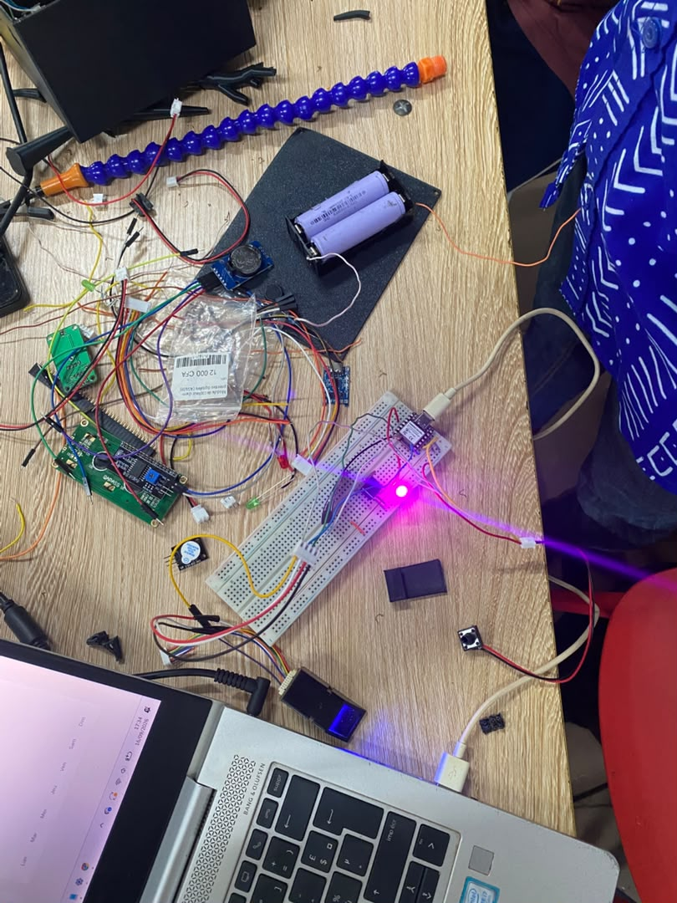

# Journal — mercredi 16 septembre 2026 ( Rédigé par : Justin FOLLI )

## Fait aujourd'hui

Avant dernier jour de journal, et clairement l'une des journées les plus intenses de tout le projet.

### Boîtier et PCB

**Marc et Victorienne** ont pris en charge la réimpression du boîtier, cette fois avec toutes les corrections identifiées la veille. Pendant ce temps, **Moïse** a finalisé le **PCB** et lancé son impression.

### Capteur d'empreinte digitale et route API

De mon côté, je me suis attaqué au **capteur d'empreinte digitale** reçu la veille, pour l'intégrer complètement dans le code. J'ai configuré sa **route API** afin de le relier proprement à notre site web.

### Le module RTC et un vrai casse-tête technique

Nous avons également reçu notre **dernier composant manquant**, le module **RTC DS3231**, que j'ai intégré au projet. Et c'est là que les choses se sont corsées.

Des fonctions comme la **connexion à Internet** ou la **synchronisation** prenaient tellement de temps à répondre qu'elles bloquaient complètement le reste du processus. Après plusieurs heures de debug, j'ai fini par penser aux **threads** — logique, puisqu'on est en MicroPython.

Et ça a marché. Les threads m'ont permis de garder mes fonctions basiques réactives, pendant que les fonctions plus lentes s'exécutent tranquillement en parallèle, sans tout bloquer.

_Console Thonny confirmant le bon fonctionnement des threads_

### Vérification et découpe du PCB

Avant de passer à la soudure, j'ai fait une **dernière vérification** du PCB pour m'assurer que tout était correct.

_PCB après découpe_

Nous avons été freinés par un **problème de perceuse**, mais avons quand même pu commencer. Le **perçage et la soudure** seront finalisés demain, en tout premier.

### Côté Laravel

Pour finir, j'ai apporté plusieurs **modifications sur le site Laravel**, afin de bien l'adapter au code MicroPython final.

_Ci dessous une image du système en fonctionnement sur la plaquette d'essai_

---

## Appris

- Un blocage qui ressemble à un simple "ça rame" peut en réalité venir d'une **exécution séquentielle** : tant qu'une fonction lente (connexion, synchronisation) n'a pas fini, rien d'autre n'avance.
- Les **threads en MicroPython** permettent de vraiment débloquer ce genre de situation : on continue à exécuter le cœur du programme pendant que les tâches lentes tournent en arrière-plan.
- Vérifier un **PCB avant soudure** évite de souder sur une erreur qu'on ne pourra plus corriger facilement après coup.

---

## Raté, puis corrigé

- Blocage du programme MicroPython dû aux fonctions longues (connexion internet, synchronisation) → plusieurs heures de debug → résolution grâce à l'utilisation des **threads**, qui permettent une exécution parallèle sans bloquer le reste du système.

## Décidé

- Le perçage et la soudure du PCB seront terminés demain matin, en priorité absolue.
- Objectif fixé pour demain : **finir le projet avant midi**, consacrer l'après-midi aux **tests** et à la **préparation de la présentation**.

## À faire demain

- [ ] Finaliser le perçage et la soudure du PCB — **Moïse**
- [ ] Assembler l'ensemble du système (boîtier, PCB, capteurs) — **Groupe 10**
- [ ] Tester le système complet de bout en bout — **Groupe 10**
- [ ] Préparer la présentation finale du projet — **Groupe 10**
