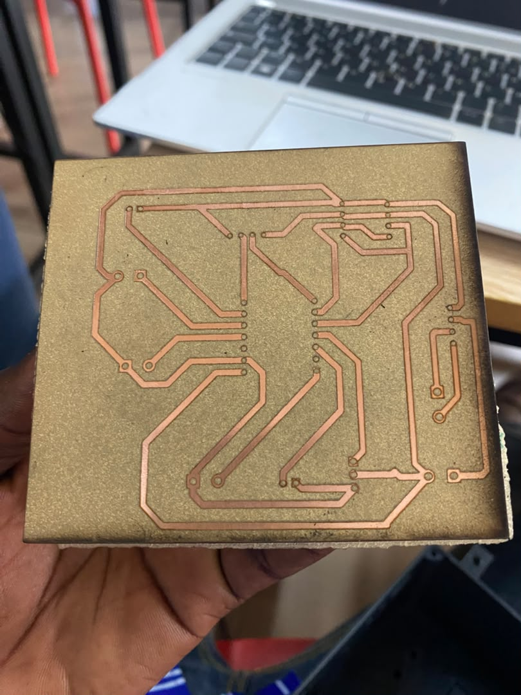
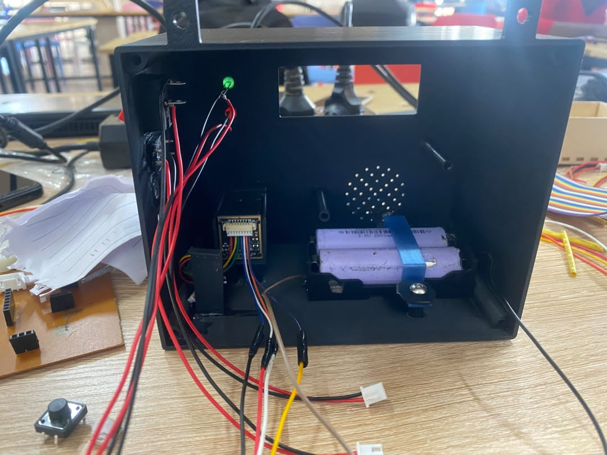
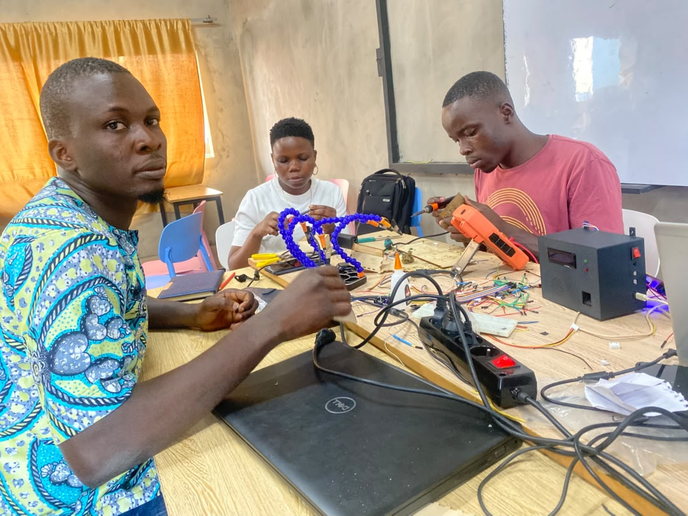

# Journal — jeudi 17 septembre 2026 (Rédigé par : Justin FOLLI)

---

## Fait aujourd'hui

Dernier jour de projet avant la présentation de demain. Une journée à rebondissements, mais qui se termine sur une bonne note.

### Finalisation du PCB :

La matinée a commencé par la **finalisation du PCB**. Dès l'impression terminée, l'équipe a enchaîné directement avec la **soudure** de tous les composants.

Et c'est une fois toutes les soudures faites qu'on a découvert le problème : le PCB n'avait **pas été miroté avant impression**. Résultat, impossible de positionner correctement le microcontrôleur sur la carte. Un vrai coup dur après tout ce travail de soudure.

Il a donc fallu **relancer l'impression à la dernière minute**, puis **refaire toutes les soudures**, pas à pas, cette fois en vérifiant soigneusement la **continuité des pistes** à chaque étape pour ne pas revivre ce genre de surprise.

_(Image à ajouter ici : le PCB final après correction et resoudure.)_

### Derniers ajustements du code (ma partie)

De mon côté, je me suis concentré sur les **derniers réglages du code MicroPython** : personnalisation des messages affichés sur l'écran, et correction des derniers bugs qui traînaient encore.

En parallèle, j'ai aussi revu le **code Laravel**, en ajoutant des **popups de succès ou d'échec** sur les différentes pages, pour rendre l'expérience utilisateur plus claire.

### Le bug de trop

Et puis, comme pour couronner cette journée mouvementée : au moment d'envoyer le code final sur l'ESP, le système a connu un **bug total**. Sur le moment, difficile de savoir si tout allait tenir à temps pour demain. Après **plusieurs heures de debug**, acharnées mais payantes, le problème a fini par être résolu.

---

## Appris

- Le **miroir avant impression d'un PCB** n'est pas un détail technique parmi d'autres : l'oublier peut invalider tout le travail de soudure déjà réalisé, même quand chaque composant est parfaitement soudé.
- Vérifier la **continuité des pistes** à chaque étape de soudure, plutôt qu'à la toute fin, permet de repérer un problème avant qu'il ne se propage à tout le montage.
- Un bug de dernière minute, même stressant à quelques heures d'une présentation, se résout presque toujours avec de la méthode et de la persévérance — le vrai risque, c'est de paniquer plutôt que de déboguer calmement.
- Une journée « catastrophe » peut quand même se terminer en victoire : le PCB refait, le code stabilisé, le système fonctionnel. C'est souvent dans ces moments tendus qu'une équipe se soude vraiment (au sens propre comme au figuré).

---

## Raté, puis corrigé

- PCB soudé entièrement avant de constater qu'il n'avait pas été miroté à l'impression → microcontrôleur impossible à positionner → réimpression en urgence et resoudure complète, avec vérification systématique de la continuité des pistes.
- Bug total du système après envoi du code sur l'ESP → plusieurs heures de debug → système finalement stabilisé et fonctionnel.

## Décidé

- Le PCB corrigé (bien miroté cette fois) est validé comme version finale pour la présentation de demain.
- Le système, une fois le bug résolu, est considéré comme prêt à être présenté.

## À faire demain

- [ ] Faire une dernière vérification complète du dispositif avant la présentation — **Groupe 10**
- [ ] Présenter le projet — **Groupe 10**
